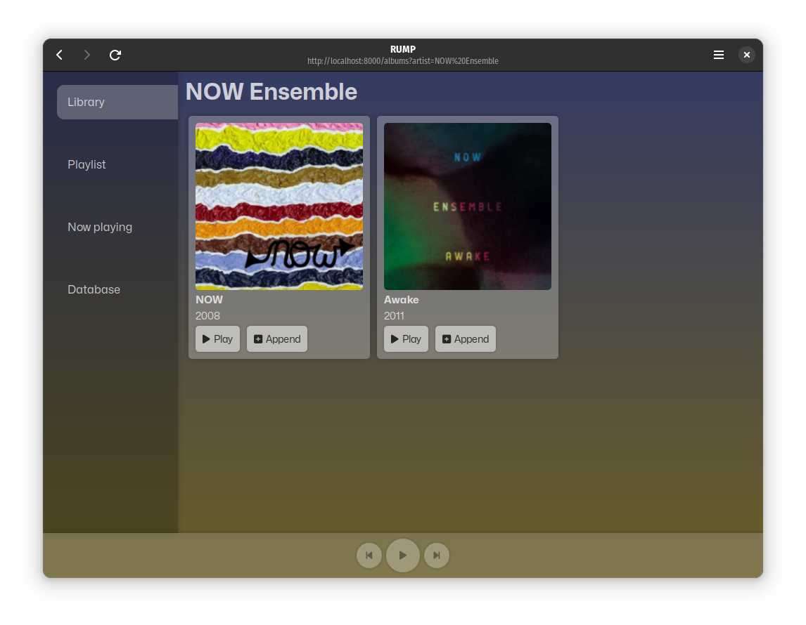
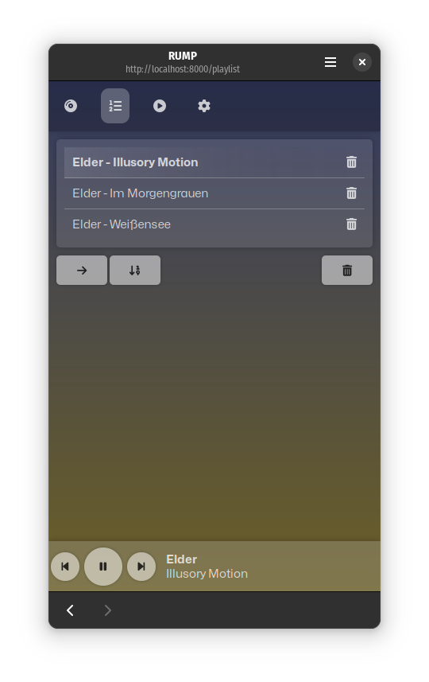
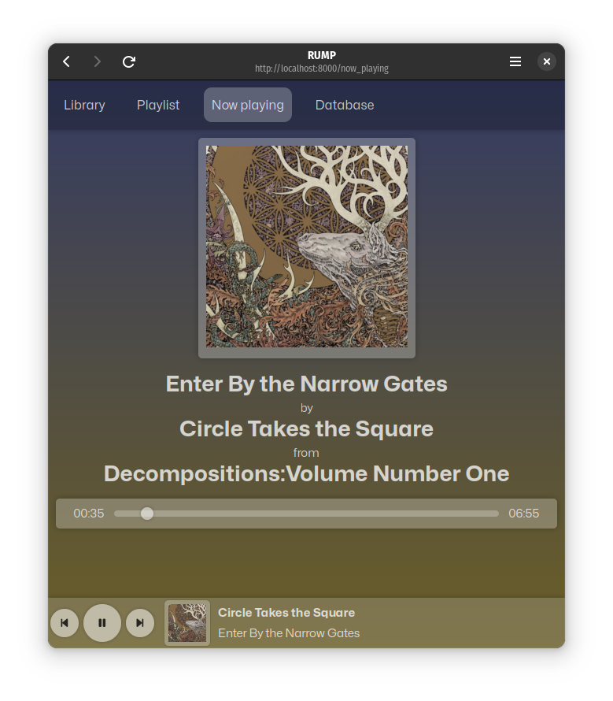

# RUMP

Music Player Daemon [MPD](https://www.musicpd.org/) web client written in Rust.

Once compiled (with `cargo build --release`), just run the binary (`./target/release/rump`). By default, it connects to `"localhost:6600"`. If you wish to change it, just define `MPD_HOST` and `MPD_PORT` environment variables.

## Features

- Responsive design for almost every form factor from small phone to 4K display
- Type-ahead search of artists
- Playlist management; play/enqueue certain song or album
- Toggle playmode (repeat, random)
- Display album art
- Show currently playing song
- Simple MPD database statistics with option to refres MPD database

## Screenshots

